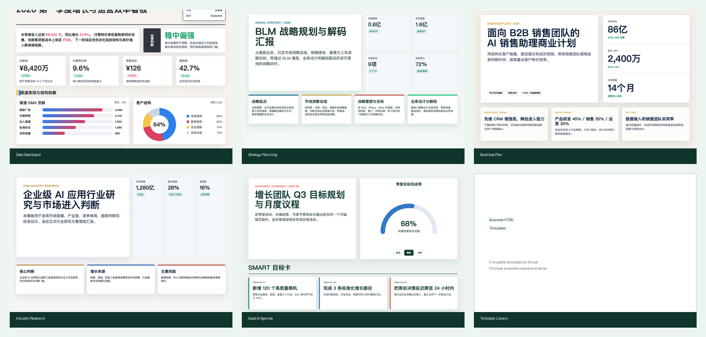
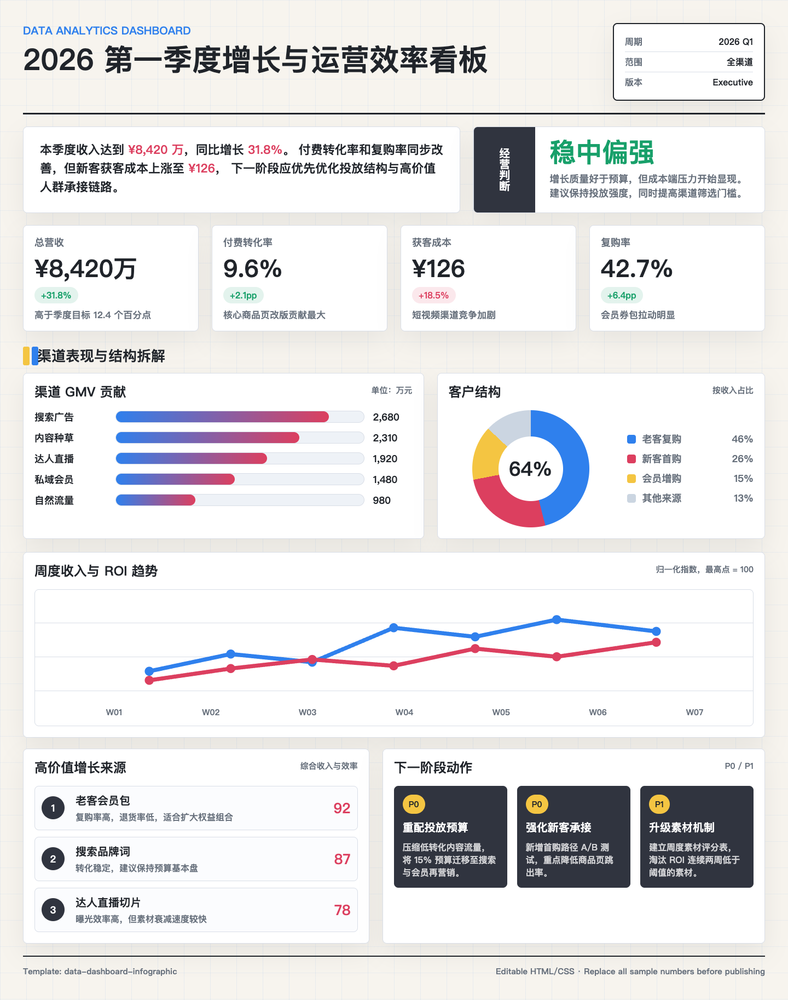
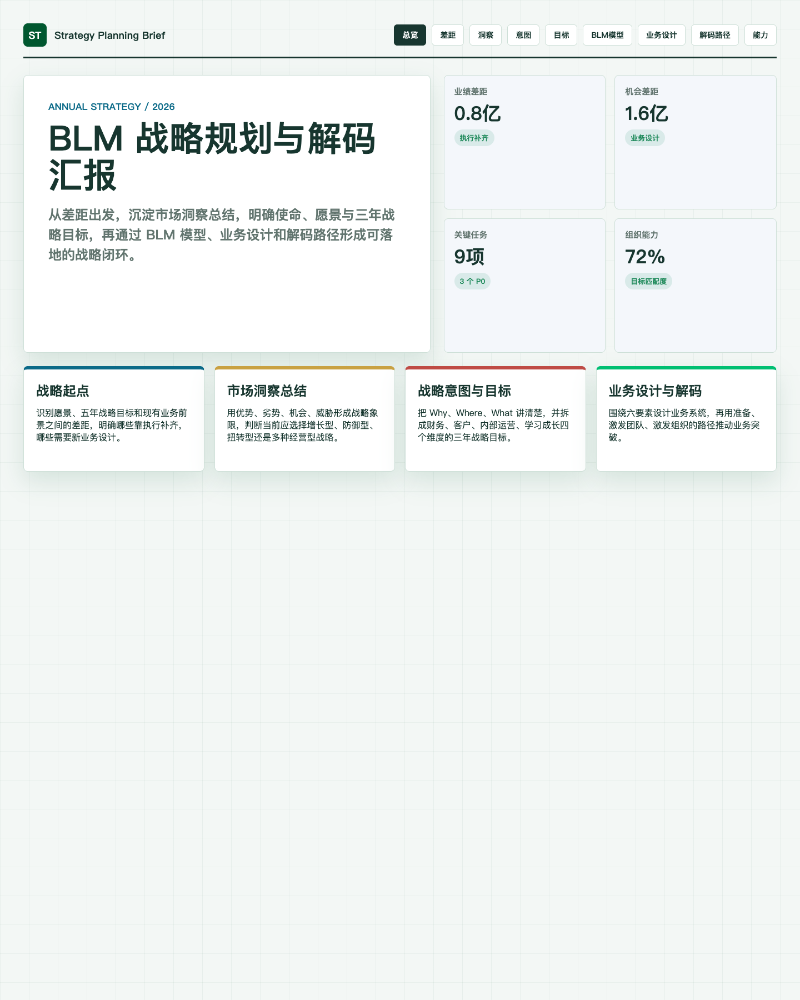
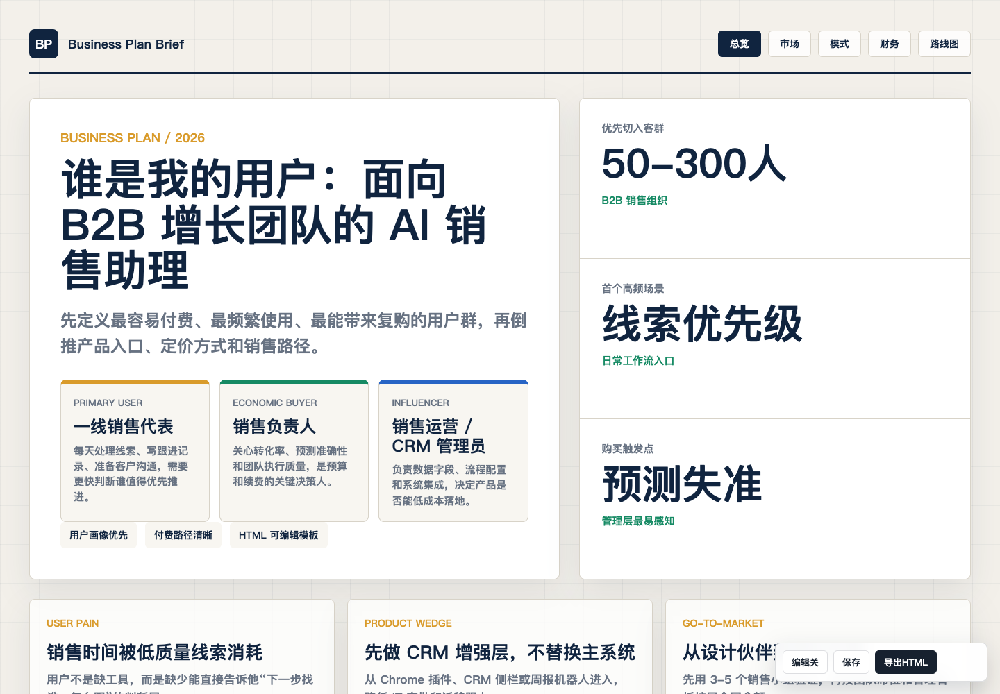
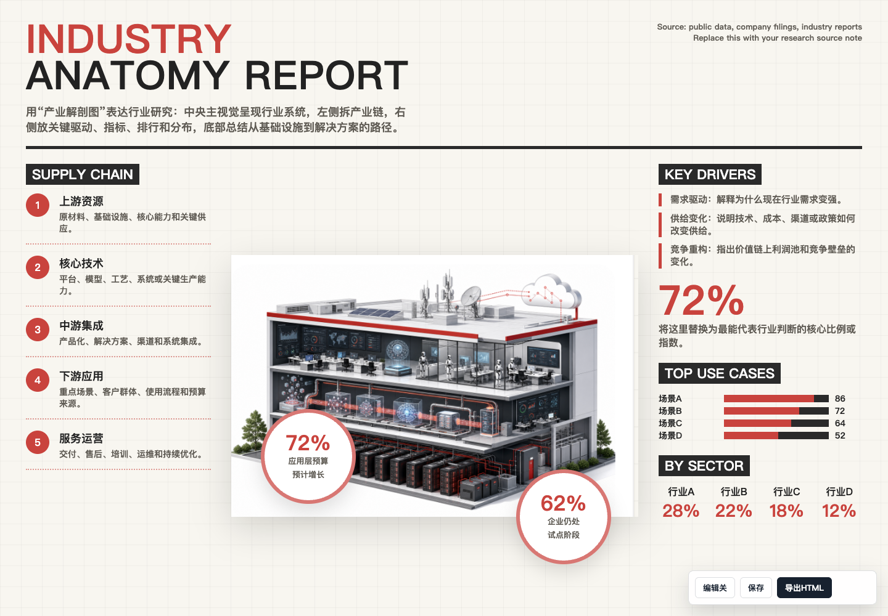
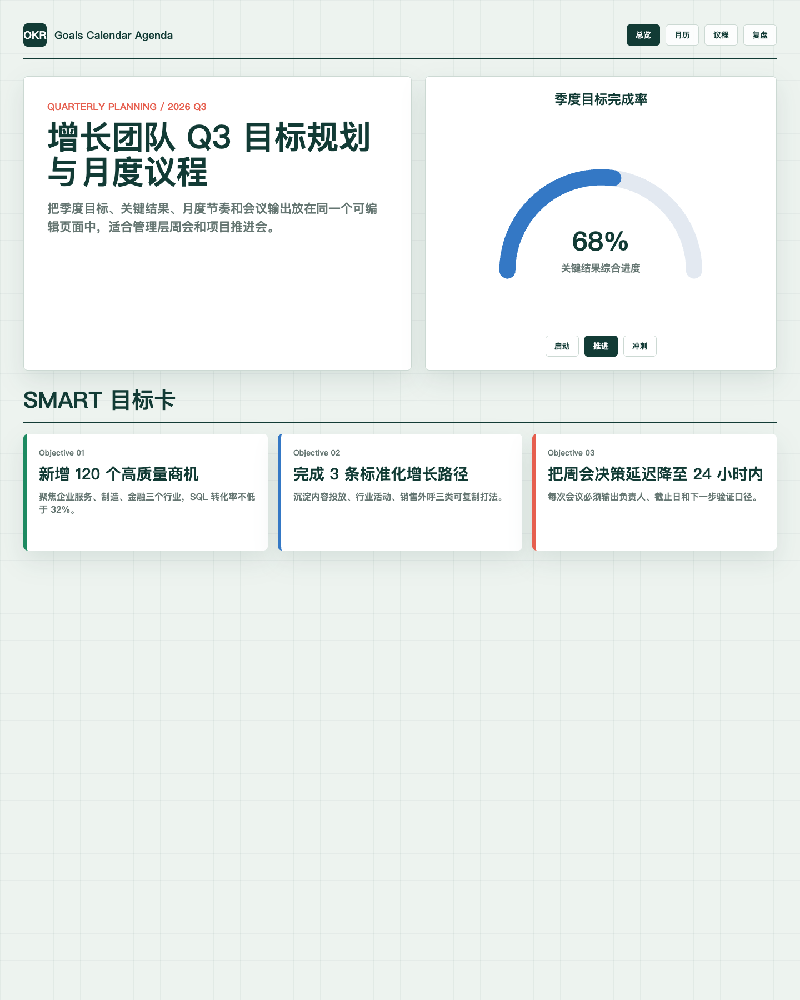

# Business HTML Templates

Reusable HTML templates for formal Chinese business presentations, reports, planning documents, and data-heavy browser decks.



Use this repository when a plain slide deck is too static, but a full web app is unnecessary: KPI dashboards, BLM strategy planning, industry research, business plans, OKR calendars, and executive-facing one-page reports.

## Install As A Codex Skill

Clone this repository into your Codex skills directory:

```bash
cd ~/.codex/skills
git clone https://github.com/MichaelMao21/business-html-templates.git
```

Then ask Codex to use it:

```text
使用 business-html-templates，帮我生成一页战略规划汇报 HTML。
```

You can also ask Codex directly:

```text
请把这个 GitHub 仓库安装为 Codex skill：
https://github.com/MichaelMao21/business-html-templates.git
```

## Template Gallery

Open [gallery.html](gallery.html) in a browser to compare all templates visually.

### Data Dashboard Infographic



Best for KPI reviews, financial summaries, operating dashboards, growth dashboards, and one-page business reviews.

### Strategy Planning Brief



Best for BLM strategy planning, gap analysis, market insight, strategic intent, business design, strategy decoding, and capability reviews.

### Business Plan Brief



Best for startup pitches, internal proposals, investment-style business cases, roadmap planning, and financial path explanations.

### Industry Research Report



Best for market sizing, industry chain analysis, trend analysis, competition matrix, and conclusion framing.

### Goals Calendar Agenda



Best for OKR planning, monthly calendars, weekly agendas, project cadence, owners, milestones, and progress tracking.

## Templates

| Scenario | Template | Best For |
| --- | --- | --- |
| Data dashboard | [`data-dashboard-infographic`](data-dashboard-infographic/template.html) | KPI reviews, financial summaries, operating dashboards, growth dashboards |
| Business plan | [`business-plan-brief`](business-plan-brief/template.html) | Startup pitches, internal proposals, investment-style business cases |
| Strategy planning | [`strategy-planning-brief`](strategy-planning-brief/template.html) | BLM strategy planning, gap analysis, market insight, strategic intent, strategy decoding |
| Industry research | [`industry-research-report`](industry-research-report/template.html) | Market sizing, industry chain, trend analysis, competition matrix, conclusions |
| Goals and agenda | [`goals-calendar-agenda`](goals-calendar-agenda/template.html) | OKR planning, monthly calendars, weekly agendas, project cadence |

## Prompt Examples

```text
使用 business-html-templates，根据这份季度经营数据，生成一页数据看板 HTML。
```

```text
使用 business-html-templates，帮我做一页 BLM 战略规划汇报。
```

```text
使用 business-html-templates，根据这份行业资料，生成一页行业研究报告 HTML。
```

```text
使用 business-html-templates，基于 business-plan-brief，生成一页 AI 销售助手商业计划书。
```

## How To Use

1. Open `gallery.html` and choose the closest template.
2. Start from `template.html` for a blank version, or from a complete file in `examples/`.
3. Edit text directly in the browser where editable controls are available.
4. Update SVG chart values in the HTML when the data changes.
5. Export or save the final HTML as a standalone deliverable.

## Repository Structure

```text
.
  README.md
  SKILL.md
  index.json
  SPEC.md
  CONTRIBUTING.md
  gallery.html
  validate-index.js
  validate-render.js
  _shared/
  data-dashboard-infographic/
  business-plan-brief/
  strategy-planning-brief/
  industry-research-report/
  goals-calendar-agenda/
```

## Validation

Install dependencies:

```bash
npm install
```

Run all checks:

```bash
npm run validate
```

Or run checks separately:

```bash
node validate-index.js
node validate-render.js
```

The validators check template metadata, required files, complete examples, broken images, desktop/mobile horizontal overflow, and editable controls.

## Codex Skill

`SKILL.md` turns this repository into a reusable Codex skill. It tells Codex when to use the library, how to choose a template, and what quality checks to run before delivering HTML.

## Contributing

Read [SPEC.md](SPEC.md) and [CONTRIBUTING.md](CONTRIBUTING.md) before adding templates. A useful template should include a real example, reusable layout fragments, screenshots, metadata, design notes, and validation coverage.
